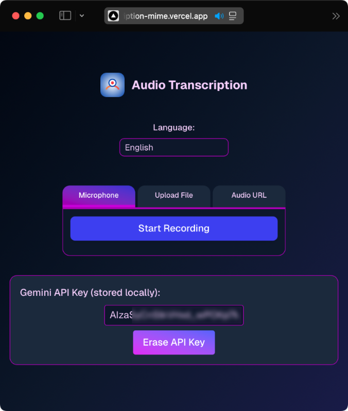

# Audio Transcription App

This project is a web application that allows you to transcribe audio to plain text using three methods:
- Microphone (browser speech recognition)
- Uploading an audio file
- Providing an audio file URL

The app uses the Google Generative Language API (Gemini) for file and URL transcription. Microphone transcription uses your browser's built-in speech recognition (if available).

## Screenshot



## Demo

[Live Demo](https://audio-transcription-mime.vercel.app)

## Features
- **Language Selector:** Choose from multiple languages for transcription. The selected language is used for both Gemini and microphone transcription. English is the default.
- **Modern UI:** Responsive, mobile-friendly design with light/dark mode support and a custom color palette.
- **Tabs:** Easily switch between microphone, file upload, and URL input methods.
- **Transcript Box:** Transcript appears only after a result is available.
- **Gemini API Key Management:** If no Gemini API key is found in your environment, the app will prompt you to enter and save it locally in your browser. You can view or erase the stored key at any time from the UI.

## Getting Started

1. Clone the repository:
   ```bash
   git clone https://github.com/miguelcarrascoq/nextjs-audio-transcription.git
   cd nextjs-audio-transcription
   ```
2. Install dependencies:
   ```bash
   npm install
   ```
3. Add your Gemini API key to a `.env.local` file:
   ```bash
   GEMINI_API_KEY=your-gemini-api-key-here
   ```
4. Run the development server:
   ```bash
   npm run dev
   ```
5. Open [http://localhost:3000](http://localhost:3000) in your browser.

## Usage
- Use the tabs to select your preferred transcription method.
- Use the language selector to choose the language for transcription.
- For file/URL transcription, your Gemini API key is required.
- For microphone transcription, your browser must support the SpeechRecognition API.
- The transcript will appear below once transcription is complete.
